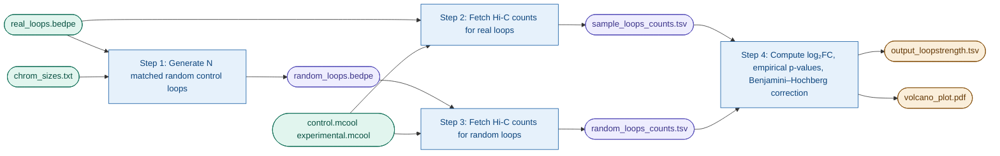

# loopstrength

**Quantify chromatin loop strength changes between two Hi-C conditions.**

`loopstrength` compares contact counts at previously called Hi-C loops against size- and distance-matched random control loops to compute empirical p-values and log₂ fold changes. Results are summarised in a TSV table and a volcano plot.

---

## How it works

For each real loop, *N* random loops are generated preserving chromosome, anchor sizes, and loop distance. Raw or balanced contact counts from two `.mcool` files (condition A / condition B) are fetched for both sets. Log₂ fold changes are computed with a pseudocount of 1; empirical two-sided p-values are derived from the null distribution of random loop logFCs, then corrected with Benjamini–Hochberg.



---

## Repository layout

```
loopstrength/
└── data
    ├── dm6.chrom.sizes.txt             # Chromosome sizes (example: Drosophila melanogaster dm6)
    ├── real_loops.bedpe                # Contains previously called loops in BEDPE format
    ├── control.mcool                   # NOT provided: mcool file for the control condition
    └── experimental.mcool              # NOT provided: mcool file for the experimental condition
├── config_loopstrength.sh              # All user-facing parameters (edit this)
├── run_pipeline.sh                     # End-to-end pipeline runner
├── environment.yml                     # Conda environment
└── scripts/
    ├── generate_random_loops_matched.sh
    ├── counts_from_mcool.py
    └── loopstrength.R
```

> `run_pipeline.sh` expects the three scripts to live in a `scripts/` subdirectory relative to itself.

---

## Requirements

| Tool | Version |
|------|---------|
| Python | 3.11 |
| cooler | 0.9.3 |
| pandas | 2.2.x |
| R | 4.3.x |
| ggplot2 | 3.5.x |
| ggrepel | 0.9.x |
| dplyr | 1.1.x |

Install everything with conda/mamba:

```bash
conda env create -f environment.yml
conda activate loopstrength
```

---

## Quick start

### 1. Prepare inputs

| File | Description |
|------|-------------|
| `real_loops.bedpe` | Hi-C loops, tab-separated BEDPE (7 columns) |
| `control.mcool` | Multi-resolution `.mcool` for condition A |
| `experimental.mcool` | Multi-resolution `.mcool` for condition B |
| `dm6.chrom.sizes.txt` | Two-column chromosome sizes (`chr  size`) |

The `.mcool` files must contain the resolution specified in `config_loopstrength.sh` (default `4000` bp). You can check available resolutions with:

```bash
cooler ls control.mcool
```

### 2. Edit the config

```bash
# config_loopstrength.sh — the only file you normally need to touch

REAL_LOOPS="data/real_loops.bedpe"              # Real Hi-C loops in BEDPE format
CONTROL_MCOOL="data/control.mcool"              # Control condition mcool file
EXPERIMENTAL_MCOOL="data/experimental.mcool"    # Experimental condition mcool file
CHROMSIZES="data/dm6.chrom.sizes.txt"           # Chromosome sizes file

RANDOM_PER_REAL=500                             # Random controls per real loop
WARN_GAP=10000                                  # Warn if anchor gap < this (bp)

RESOLUTION=4000                                 # Bin resolution in bp (must exist in mcool)
BALANCE=False                                   # Whether to use balanced or raw counts (True/False) 

MIN_LOOP_SIZE=0                                 # Filter loops shorter than this (bp); 0 = no filter
SIG_THRESHOLD=0.05                              # Adjusted p-value significance cutoff
CONDITION_A="Control"                           # Label for condition A (control)
CONDITION_B="Experimental"                      # Label for condition B (experimental)

OUTPUT_DIR="results"                            # Directory for all pipeline outputs

CANONICAL=("chr2L" "chr2R" "chr3L" "chr3R" "chr4" "chrX")
```

### 3. Run

```bash
bash run_pipeline.sh                        # uses config_loopstrength.sh
```

---

## Outputs

All outputs are written to `OUTPUT_DIR` (default: `results/`).

| File | Description |
|------|-------------|
| `random_loops.bedpe` | Matched random control loops |
| `sample_loops_counts.tsv` | Real loop counts (both conditions) |
| `random_loops_counts.tsv` | Random loop counts (both conditions) |
| `output_loopstrength.tsv` | Full results: logFC, pval, padj, loop_size |
| `volcano_plot.pdf` | Volcano plot; significant loops labelled |
| `pipeline.log` | Timestamped log of all pipeline steps |

### `output_loopstrength.tsv` columns

| Column | Description |
|--------|-------------|
| `chrom1–end2` | Loop anchor coordinates |
| `loop_id` | Loop identifier |
| `control_count` | Raw/Balanced Hi-C counts, condition A |
| `experimental_count` | Raw/Balanced Hi-C counts, condition B |
| `loop_size` | Distance between anchor starts (bp) |
| `logFC` | log₂(experimental+1 / control+1) |
| `pval` | Empirical two-sided p-value |
| `padj` | BH-adjusted p-value |

---

## Running steps individually

Each script can be run standalone.

**Generate random loops:**
```bash
bash scripts/generate_random_loops_matched.sh \
  --real-loops  data/real_loops.bedpe \
  --chromsizes  data/dm6.chrom.sizes.txt \
  --output      results/random_loops.bedpe \
  --per-real    500 \
  --canonical   "chr2L chr2R chr3L chr3R chr4 chrX"
```

**Fetch Hi-C counts:**
```bash
python3 scripts/counts_from_mcool.py \
  data/real_loops.bedpe \
  data/control.mcool \
  data/experimental.mcool \
  4000 \
  > results/sample_loops_counts.tsv
```

**Run R analysis:**
```bash
export SAMPLE_LOOPS=results/sample_loops_counts.tsv
export RANDOM_LOOPS=results/random_loops_counts.tsv
export OUTPUT_DIR=results
export SIG_THRESHOLD=0.05
export CONDITION_A=Control
export CONDITION_B=Experimental
Rscript scripts/loopstrength.R
```

---

## BEDPE format

```
chrom1  start1  end1  chrom2  start2  end2  loop_id  [source_loop_id]
chr2L   100000  101000  chr2L  200000  201000  loop_1
```

- Only **cis** loops (same chromosome) are processed; trans loops are skipped with a warning.
- Only loops on **canonical chromosomes** (defined in config) are used.
- The `loop_id` column is used for labelling significant loops in the volcano plot.
- The `source_loop_id` column is used for linking random loops to real loops. Only present in `random_loops_counts.tsv`.

---

## Known limitations

- **p-value resolution is bounded** at 1/N of the null size, where N = random loops per real loop. Insufficient N will limit the statistical power to detect true effects.
- **Trans loops** are excluded. Real trans loops are skipped and no matched random loops are computed due to inconsistencies in loop size calculations.

---

## License

MIT — see `LICENSE`.
